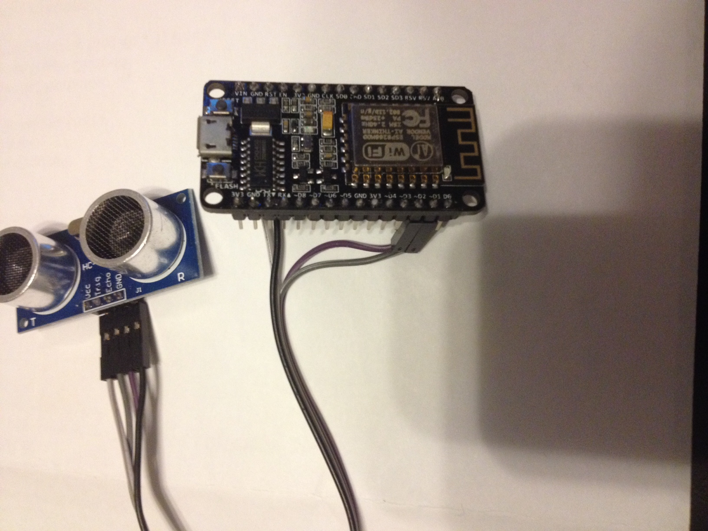
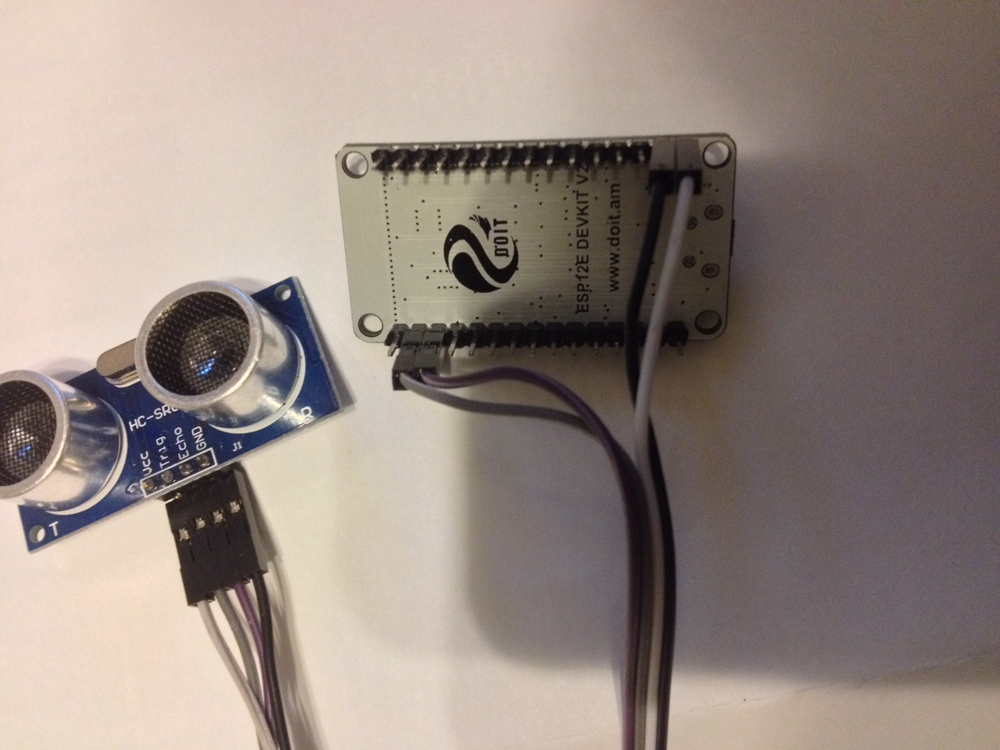

# ESP8266_12E Workshop
Workshop exercises for the ESP8266 12E (NodeMCU 1.0)

This workshop is based around the ESP8266 ESP-12E using Arduino versus NodeMCU (Lua) build that comes on it from the factory.
Arduino on ESP 12-E.  This will work very similarly to other arduinos.

##Verify that your board works
Out of the box the NodeMCU 1.0 can be tested with the default NodeLua 1.0 build.  This will verify that the hardware and WiFi is working correctly:

1. Plug the board into a USB port to power it
2. The SSID of the board should be "DoitWifi", and the password is "12345678".  On your computer with Wifi enabled connect to this wifi SSID and enter the password.  
3. Once your computer is connected, open a browser at 192.168.1.1
4. Click the D0 button in the HTML form to verify the light turns on and the board is working

##Software Prerequisites

1. If using the latest Node MCU 1.0 ESP-12E from DoIt, you will need to ensure you have the CH341 driver installed.  This board uses the CH341 USB driver.
* For Mac you can find the kext signed package [here](packages/CH34x_Install-KextSigned-Mac)
* For Windows you can find the kext signed package [here](packages) and download 'CH341SER-Windows.zip'
* The original place these drivers were uploaded are [here.](http://blog.sengotta.net/wp-content/uploads/2015/11/CH34x_Install.zip)

2. If you already have Arduino IDE installed make sure you upgrade to 1.6.7.  If not download from arduino.cc the [latest arduino IDE](https://www.arduino.cc/en/Main/Software) and install it.

3. Launch the Arduino IDE and let's make sure you have the right board support package for the ESP-12E.  
* In the Arduino menu select Preferences and enter the following url: ~~`http://arduino.esp8266.com/staging/package_esp8266com_index.json`~~  `http://arduino.esp8266.com/stable/package_esp8266com_index.json` in the Additional Boards Manager URL's box.   
* Save and close the dialog
* In the Arduino IDE goto Tools->Boards->'Board Manager' and then in list scroll down and select esp8266 and choose install. 
* Make sure to restart the IDE
* Make sure to select the proper board.  Select the Tools->Boards->'nodeMCU 1.0'  (for the bangood board or others per what you have selected) 
* Select the port corresponding to the wcuusb port and ensure the baud rate is 115200 (and other specs are set per the screenshot).  

##Setup Firebase 
Now let's setup your Firebase account

1. Go to https://www.firebase.com/ and create a firebase account (you can use your Google login or your email)
2. Login and note your firebase host name (not the full url just the host name)
3. In the firebase console, clink the Data icon on the left.  Hover over the top node showing in the tree view and Click "+" to add a new key and value pair  - name:"test_get" and value:"testgetvalue"
4. Verify that Firebase works for both GET and POST
		curl --trace - -X GET https://<yourfirebaseurl>/test_get.json
		curl --trace - -X POST -d '{ "postkey":"postvalue"}' https://<yourfirebaseurl>/test_get.json

##Exercise 1
Let's do the HelloWorld of the embedded world.

1. Under /exercises in this repository, open the '/dualblink/dualblink.ino` sketch.  
2. From the Arduino menu select Sketch->Upload.  
3. Verify the lights are blinking.  Congrats you have your first sketch running
> NOTE: If there’s an issue with compiling might need to blow away cache directory and start over from step 3.  On Mac cache is in `/Users/<username>/Library/Arduino15` (just delete the directory)

##Exercise 2
Now let’s get connected to your local wifi router.  
> NOTE: You will need to ensure that your local wifi router does not have any kind of web auth/proxy auth enabled and that you know the SSID and Password.

1. Under /exercises in this repository, open the '/wificonnect/wificonnect.ino` sketch.
2. Open the Serial Monitor (magnifying glass icon in upper right of code window).
3. At the top of your open sketch, set `WIFI_SSID` and `WIFI_PASS` variables to your local Wifi SSID and Password respectively
4. From the Arduino menu select Sketch->Upload.  Verify that the sketch compiled with no errors.
5. Verify the output in the Serial Monitor window says `connected`.

##Exercise 3

1. Ensure you setup yoru Firebase account as outlined in the prerequisite section.
2. Verify the Firebase SHA1 fingerprint
	1. Login to your Firebase account.  
	2. Select your Application and click Manage App.  
	3. In the url bar you will see your firebase url.  Copy it.
	4. Pull down the SHA1 fingerprint for your firebase url.  Use this site to get your fingerprint: https://www.grc.com/fingerprints.htm (paste in your firebase url from above)
3. Now let's test HTTP GET and HTTP POST to Firebase.
	1. Under /exercises in this repository, open the `/httprequests/httprequests.ino` sketch.
	2. Open the Serial Monitor (magnifying glass icon in upper right of code window).
	3. At the top of your open sketch, set WIFI_SSID and WIFI_PASS variables to your local Wifi SSID and Password respectively
	4. If you are using Firebase as outlined in step 2 above, then in your open sketch set BAAS_HOST to the firebase host name that is associate with your account.  NOTE: You may also need to set the Hexadecimal BAAS_FINGERPRINT variable to be the Fingerprint you obtained in step 2->4 above (if the SSL cert has changed).
	5. From the Arduino menu select Sketch->Upload.  Verify that the sketch compiled with no errors.
	6. Verify the output in the Serial Monitor window shows a successful GET request as well as POST request.

##Exercise 4
Now lets double check the GPIO pins are working and mapped correctly.

1. Connect a jumper wire as show between "D1" and "D2" on the ESP 8266 12E board.  
2. Under /exercises in this repository, open the /testgpio/testgpio.ino sketch.
3. From the Arduino menu select Sketch->Upload.  Verify that the sketch compiled with no errors.
4. Check to see if the output in the Serial Monitor windows alternates in sequence between 1 (on) and 0 (off) with the LED also.

##Exercise 5
Now let's read from the ultrasonic sensor in a loop.

1. Connect 4 jumper wires between the ESP8266 board and the HC-SR04 Ultrasonic sensor as shown.  
	1. Vin from ESP8266 to VCC on HC-SR04
	2. Gnd from ESP8266 to GND on HC-SR04
	3. D1 from ESP8266 to TRIG on HC-SR04
	4. D2 from ESP8266 to ECHO on HC-SR04

2. Under /exercises in this repository, open the /readultrasonic/readultrasonic.ino sketch.
3. Place the Ultrasonic Sensor with the transmitter/receiver facing up.
4. From the Arduino menu select Sketch->Upload.  Verify that the sketch compiled with no errors.
5. Hold & move your hand above the Ultrasonic sensor and note the distance calculations in the Serial Monitor output window.
6. Check to see if the output in the Serial Monitor is roughly accurate.

##Exercise 6
Now lets write what we read from the sensor to Firebase in a loop.

1. Retain the setup from Exercise 5. 
2. Under /exercises in this repository, open the /sendtofb/sendtofb.ino sketch.
3. At the top of your open sketch, set WIFI_SSID and WIFI_PASS variables to your local Wifi SSID and Password respectively
4. If you are using Firebase as outlined in exercise 3 above, then in your open sketch set BAAS_HOST to the firebase host name that is associate with your account.  NOTE: You should also make sure that BAAS_FINGERPRINT variable to be the Fingerprint you obtained in exercise 3.
3. From the Arduino menu select Sketch->Upload.  Verify that the sketch compiled with no errors.
4. Check to see if the output in the Serial Monitor windows shows successful POST requests to firebase.  In your firebase console you should see new values appear every couple of seconds as the program samples the distance sensor.
5. Move your hand closer and further from the distance sensor and observe the change in values in firebase.  There's a range limit emprically between about 1 inch and 15 inches.  YMMV.
6. Optional: Tune the program further to reduce the noisy readings from the distance sensor and also to address more accurate timing/distance calculations of pusle calculation if you wish - you'll have to research this.

##Exercise 7
Now let's do something useful with the data we are sending up to Firebase.  
This is an exercise for you to create, but you might want to try something out with [Zapier](https://zapier.com/zapbook/firebase/) 

