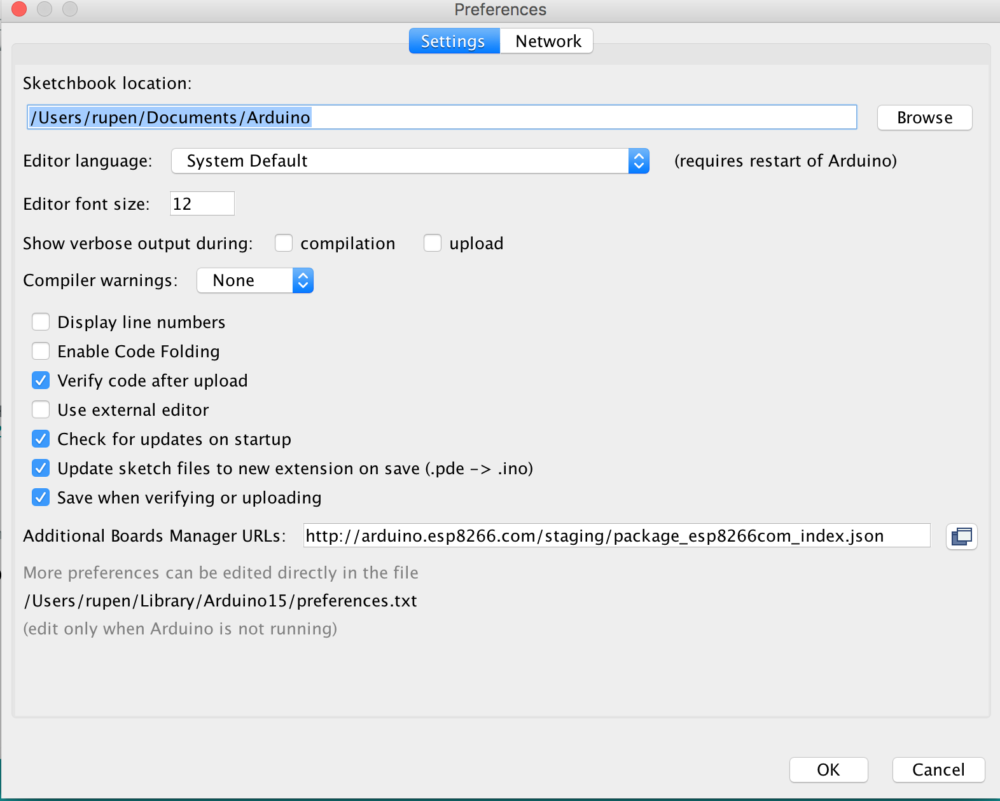
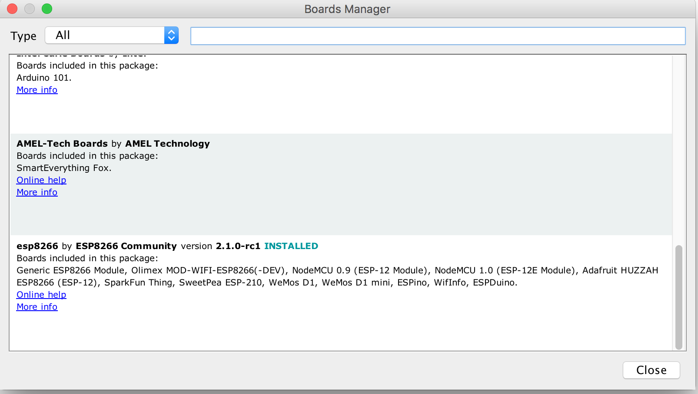
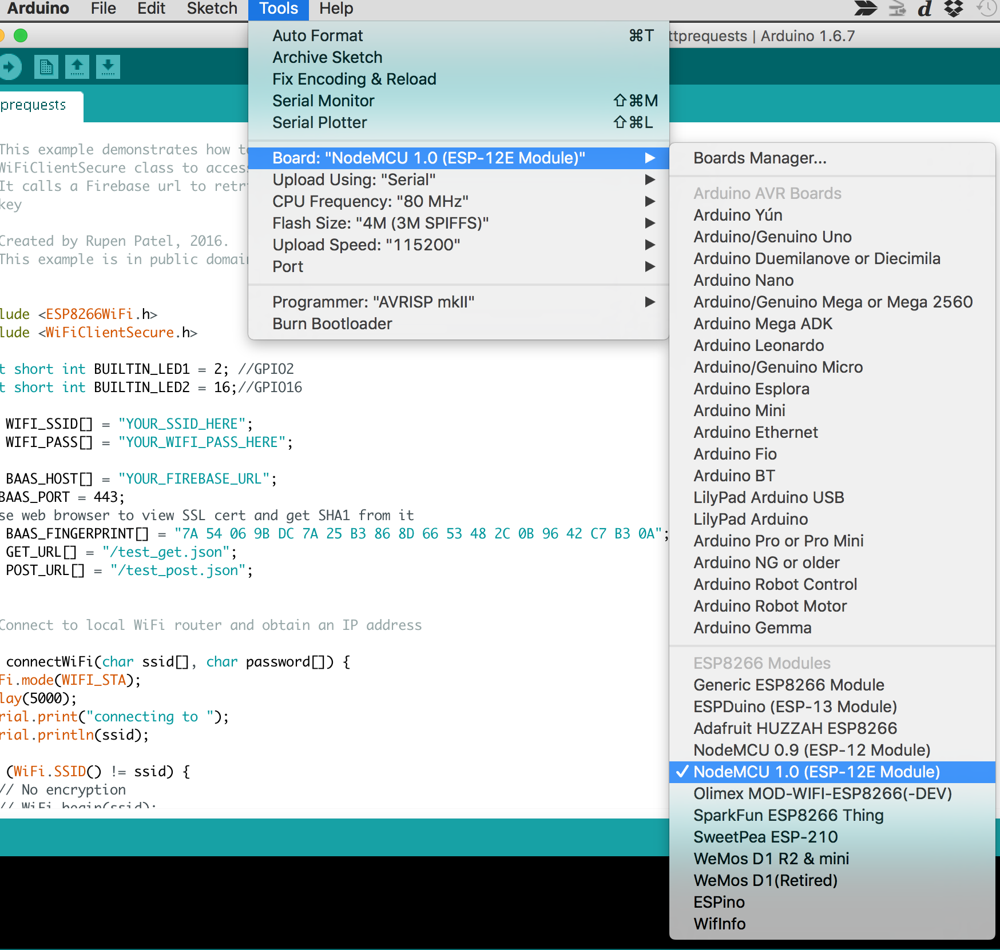
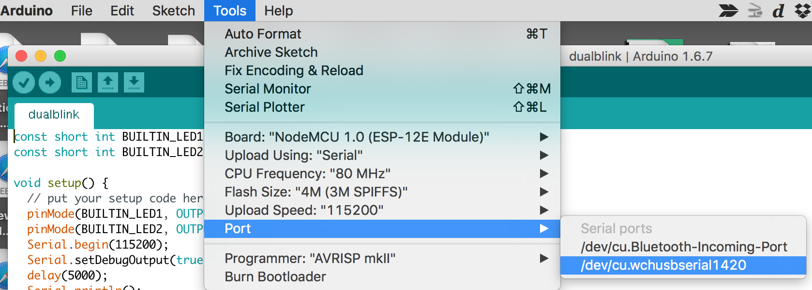
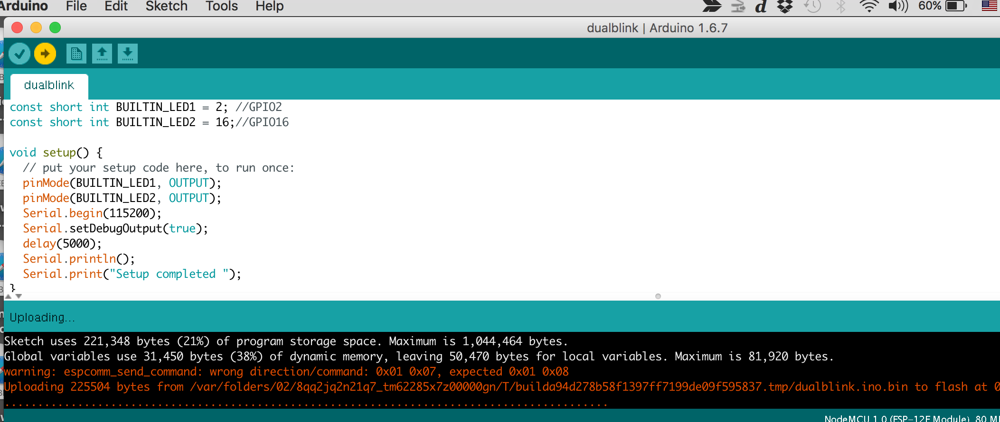

# ESP2866_12E Workshop
Workshop exercises for the ESP2866 12E (NodeMCU 1.0)

This workshop is based around the ESP8266 ESP-12E using Arduino versus NodeMCU (Lua) build that comes on it from the factory.
Arduino on ESP 12-E.  This will work very similarly to other arduinos.

##Software Prerequisites

1. If using the latest Node MCU 1.0 ESP-12E from DoIt, you will need to ensure you have the CH341 driver installed.  This board uses the CH341 USB driver.
* For Mac you can find the kext signed package [here](packages/CH34x_Install-KextSigned-Mac)
* For Windows you can find the kext signed package [here](packages) and download 'CH341SER-Windows.zip'
* The original place these drivers were uploaded are [here.](http://blog.sengotta.net/wp-content/uploads/2015/11/CH34x_Install.zip)

2. If you already have Arduino IDE installed make sure you upgrade to 1.6.7.  If not download from arduino.cc the [latest arduino IDE](https://www.arduino.cc/en/Main/Software) and install it.

3. Launch the Arduino IDE and let's make sure you have the right board support package for the ESP-12E.  
* In the Arduino menu select Preferences and enter the following url: `http://arduino.esp8266.com/staging/package_esp8266com_index.json`  ~~http://arduino.esp8266.com/stable/package_esp8266com_index.json~~ in the Additional Boards Manager URL's box.   
* Save and close the dialog
* In the Arduino IDE goto Tools->Boards->'Board Manager' and then in list scroll down and select esp8266 and choose install. 
* Make sure to restart the IDE
* Make sure to select the proper board.  Select the Tools->Boards->'nodeMCU 1.0'  (for the bangood board or others per what you have selected) 
* Select the port corresponding to the wcuusb port and ensure the baud rate is 115200 (and other specs are set per the screenshot).  

##Verify that your board works
Out of the box the NodeMCU 1.0 can be tested with the default NodeLua 1.0 build.  This will verify that the hardware and WiFi is working correctly:
1. Plug the board into a USB port to power it
2. The SSID of the board should be "DoitWifi", and the password is "12345678"
3. On your computer with Wifi enabled, open a browser at 192.168.1.1
4. Click the D0 button in the HTML form to verify the light turns on and the board is working

##Setup Firebase 
Now let's setup your Firebase account
1. Go to https://www.firebase.com/ and create a firebase account (you can use your Google login or your email)
2. Login and note your firebase host name (not the full url just the host name)
3. In the firebase console, clink the Data icon on the left.  Hover over the top node showing in the tree view and Click "+" to add a new key and value pair  - name:"test_get" and value:"testgetvalue"
4. Verify that Firebase works for both GET and POST
		curl --trace - -X GET https://<yourfirebaseurl>/test_get.json
		curl --trace - -X POST -d '{ "postkey":"postvalue"}' https://<yourfirebaseurl>/test_get.json

##Exercise 1
Let's do the HelloWorld of the embedded world.

1. Under /exercises in this repository, open the '/dualblink/dualblink.ino` sketch.  
2. From the Arduino menu select Sketch->Upload.  
3. Verify the lights are blinking.  Congrats you have your first sketch running
> NOTE: If there’s an issue with compiling might need to blow away cache directory and start over from step 3.  On Mac cache is in `/Users/<username>/Library/Arduino15` (just delete the directory)

##Exercise 2
Now let’s get connected to your local wifi router.  
> NOTE: You will need to ensure that your local wifi router does not have any kind of web auth/proxy auth enabled and that you know the SSID and Password.

1. Under /exercises in this repository, open the '/wificonnect/wificonnect.ino` sketch.
2. Open the Serial Monitor (magnifying glass icon in upper right of code window).
3. At the top of your open sketch, set `WIFI_SSID` and `WIFI_PASS` variables to your local Wifi SSID and Password respectively
4. From the Arduino menu select Sketch->Upload.  Verify that the sketch compiled with no errors.
5. Verify the output in the Serial Monitor window says `connected`.

##Exercise 3
1. Verify the Firebase SSL SHA1 fingerpting
	1. Login to your Firebase account.  
	2. Select your application and Manage App.  
	3. In the url bar you will see your firebase url.  Pull down the SHA1 fingerprint for your firebase url.  Use this site to get your fingerprint: https://www.grc.com/fingerprints.htm (paste in your firebase url)

2. Now let's test HTTP GET and HTTP POST to an online backend as a service provider called firebase.
	1. Under /exercises in this repository, open the `/httprequests/httprequests.ino` sketch.
	2. Open the Serial Monitor (magnifying glass icon in upper right of code window).
	3. At the top of your open sketch, set WIFI_SSID and WIFI_PASS variables to your local Wifi SSID and Password respectively
	4. If you are using Firebase as outlined in step 9 above, then in your open sketch set BAAS_HOST to the firebase host name that is associate with your account.  NOTE: You may also need to set the Hexadecimal BAAS_FINGERPRINT variable to be the Fingerprint you obtained in 9c (if the SSL cert has changed).
	5. From the Arduino menu select Sketch->Upload.  Verify that the sketch compiled with no errors.
	6. Verify the output in the Serial Monitor window shows a successful GET request as well as POST request.

##Exercise 4
Now lets read from our sensor.

##Exercise 5
Now lets write what we read from the sensor to Firebase in a loop.

##Exercise 6
Now let's do something useful with the data we are sending up to Firebase

